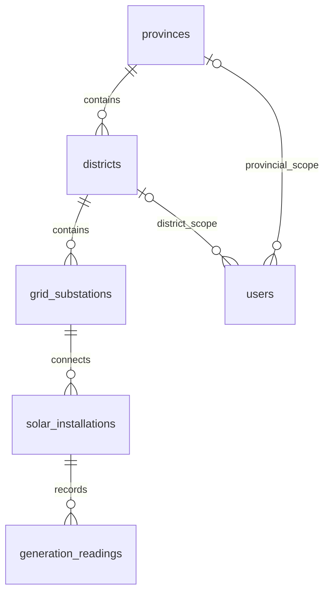

# Database model and migrations

Stage 2 implements the model agreed in the project plan. It does not add public business routes or generate the full coursework seed.

## Model

The `solar` schema contains six domain tables and one technical migration ledger:

Each child belongs to exactly one parent. A district-scoped user's province is derived through the district. The `users_role_scope_valid` constraint requires national users to have no jurisdiction FK, provincial users to have exactly a province, and district users to have exactly a district.

The meter identifier is a unique installation attribute. Readings have their own identity and history; `(installation_id, timestamp)` is unique. There is no Device domain table or last-value-only history storage.

All measurements have three decimal places, are nonnegative and finite; capacity is strictly positive. PostgreSQL `NaN` requires an explicit check, not just a nonnegative bound. Timestamp columns use timezone-aware instants with millisecond precision, and the application pool selects UTC output. PostgreSQL numeric values remain decimal strings through `pg`; future API serialization must convert them deliberately, and validation must reject unsupported timestamp/numeric precision rather than rely on database rounding.

Generation counters use `numeric(15,3)`, enough for synthetic rooftop history while keeping the scaled integer bound below JavaScript's maximum safe integer. This does not make binary floating-point decimal arithmetic exact. Stage 3/5 code must handle measurement rounding deliberately.

## Integrity boundaries

- Foreign keys reject invalid parents and restrict deletion of referenced assets. They never cascade away readings.
- A statement trigger rejects reading UPDATE, DELETE and TRUNCATE, including zero-row mutation statements. Ordinary owner-issued DML is rejected too; a schema owner remains trusted because it can explicitly alter/drop database objects.
- Hierarchy parent FKs and the installation meter identifier cannot be reassigned. This conservative first-version rule prevents moving historical readings between jurisdictions and avoids silently resetting meter counters.
- Users and installation metadata track `updated_at` through a trigger. Credential hashes are stored only as authentication metadata, never public API fields. Actual password/device-secret hashing arrives with security and seed implementation.
- Cumulative-counter ordering across neighboring observations is not enforced by a row CHECK. Stage 5 must serialize installation ingestion with a transaction/advisory lock and check the nearest predecessor/successor. The runtime account intentionally lacks UPDATE permissions, so use an advisory lock rather than requiring `SELECT FOR UPDATE` on installation metadata.
- Indexes cover parent lookups, per-installation chronological history and regional chronological scans. Validate their performance against the Stage 3 seed before adding more.

## Migration runner

Run `npm run db:migrate` with an explicitly configured `MIGRATION_DATABASE_URL`. It never falls back to the application's runtime login.

1. Load sorted files named `NNN_description.sql` from `db/migrations` and calculate SHA-256 checksums. Reject malformed names, duplicate numeric prefixes and empty SQL files.
2. Start a transaction and acquire a database/schema-specific advisory lock on one pooled connection.
3. Create the dedicated schema and `schema_migrations` ledger if missing. The migration login must own the schema.
4. Check that recorded migrations are an unchanged prefix of the current files. Missing, edited or reordered applied files are errors.
5. Execute all pending SQL and ledger inserts in the same transaction. Commit only if the whole batch succeeds; roll back the batch otherwise.

A second run is a no-op and reports already-applied versions. Add new migration files for later changes; do not edit an already-applied file. SQL files must not include their own transaction boundaries or statements requiring execution outside a transaction. There is no automatic destructive down/reset command. Application startup does not migrate or seed the database.

The ledger is operational metadata, not an extra domain entity. Migration checksums detect accidental history edits; they do not defend against a trusted database owner rewriting the ledger itself.

## Application account

Use `npm run db:grant-runtime` after migrations. It checks the actual connected identities and requires separate accounts against the same configured server/database. Provision the runtime login first; the application does not create production users or embed their passwords.

The grant helper accepts a standalone, unprivileged role. It rejects elevated attributes, memberships in other roles, ownership of the database/schema/domain objects, and unexpected effective table or column grants. It adds only schema USAGE, SELECT on the six domain tables and INSERT on generation readings. It does not revoke unfamiliar existing permissions to make the check pass; resolve the account setup explicitly.

| Account | Purpose | Intended access |
| --- | --- | --- |
| Migration owner | Explicit migration/seed administration | Own the application schema and apply trusted DDL |
| Runtime application | Running HTTP API | Read domain tables and append readings |
| Dedicated test account | Isolated integration database | Create/remove its test schemas and roles |

The runtime database account serves the whole API. It is not an analyst or a particular installation: future JWT scopes, installation ownership and jurisdiction predicates must still be applied in the application. Database privileges alone do not implement that read/write client distinction.

Local Compose creates `slsea_dev` as a development owner and initializes `slsea_app` with a public local-only fixture password. Hosted deployments must use separately provisioned secrets and an appropriately scoped migration account. Existing Compose volumes need the documented role initialization command; do not delete their volume to upgrade.

## Explanation checkpoint

Be able to trace a reading's four parent relationships, explain why two installations can have observations at the same time while duplicates on one installation are rejected, demonstrate invalid role/jurisdiction combinations, and explain the difference between append-only application privileges and a trusted schema owner's administrative powers. Show why rerunning migrations is safe and why an edited applied migration is rejected.
