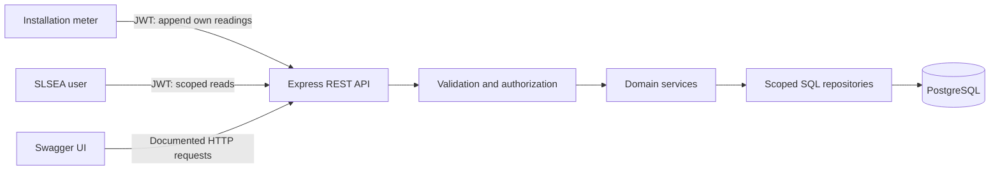
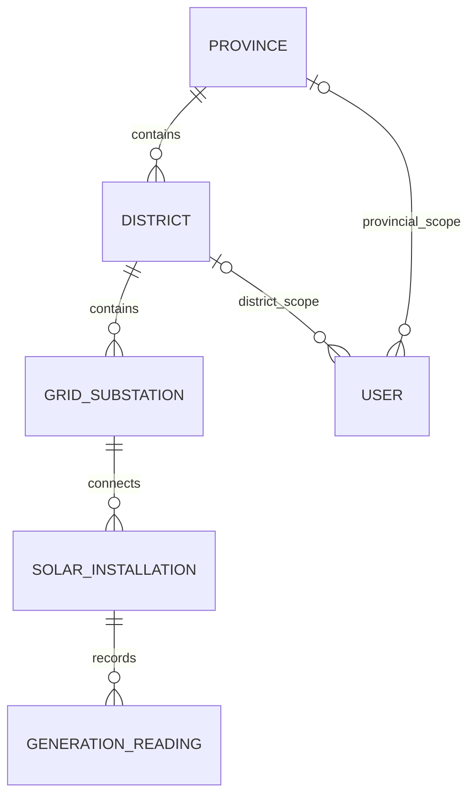

# Project plan

Prepared: 21 September 2026; updated: 23 September 2026. Status: Stages 1–6 and 8 implemented and locally verified. Stage 7 mutable-resource clarification, deployment and submission work remain open. See the README and stage evidence for setup and results.

## 1. Sources and scope

Read in full:

- `NB6007CEM_Coursework_Brief.pdf`: 9 pages, last modified 24 August 2026.
- `NB6007CEM_Marking_Rubric.pdf`: 7 pages, last modified 25 August 2026.
- `wso2_rest_api_design_guidelines.pdf`: 21 pages, found beside the supplied PDFs. Its identity as the lecturer's exact reference edition still needs confirmation.

All three files are in the student's OneDrive `Documents/Degree/Degree/Year 4/Semester 1/Web API Development` directory. Page references in these notes are physical PDF page numbers. The documents provide assessment requirements; the user's request is to plan the project carefully and then build it in understandable increments. Reading them does not authorize sending messages, sharing the repository or signing a declaration.

Build one backend service for SLSEA. Metering installations submit readings automatically; national, provincial and district users retrieve authorized data. Deliver the API and Swagger interface. A dashboard, website frontend, WebSockets, BI tool, separate device domain entity and full OAuth server are outside the planned scope.

Aim for the First-band evidence in all eight rubric dimensions. The project is not finished until deployment, evidence, submission gates and viva preparation are complete.

## 2. Decisions and outstanding inputs

| Item | Current position | Effect on work |
| --- | --- | --- |
| Backend stack | TypeScript, Express and PostgreSQL selected when the student requested completion of Stage 1 | Installed with locked dependencies; no stack is mandated by either PDF |
| Deadline | Brief says to refer to LMS; actual date is unknown | Use dependency-ordered stages now; assign dates when supplied |
| Design white paper | Local WSO2 paper found and read | Use as the likely reference; verify its edition with the student |
| CRUD contradiction | Required clarification, detailed below | Core modeling, secure reads and append-only ingestion can proceed |
| Hosting | One containerized API plus persistent PostgreSQL over secure connections | Select provider, account and spending limit before provisioning; do not assume a free tier will remain available |
| Collaborator | Module leader's GitHub username is unknown | Prepare repository and share only when the user supplies the recipient and authorizes the invitation |
| Declaration | Signed declaration required; a completed signed artifact has not been supplied | Student must review and sign their declaration |

### D1. Append-only history versus full CRUD

Brief pp3–4 restrict devices to writing readings for their own installation and describe SLSEA users as read-clients. Brief p4 and rubric p2 require immutable historical readings. Brief p5 nevertheless asks for create/retrieve/update/delete semantics across writable resources; rubric p3 explicitly asks for full CRUD on the write path.

This is unresolved in the supplied documents. Do not silently allow readings to be edited/deleted, give analyst users write access, or claim that returning `405` demonstrates full CRUD.

Proposed question for the student to put to the lecturer: **May we demonstrate full CRUD on installation metadata using a separate maintenance principal, while devices can only append their own readings and SLSEA analyst users remain read-only? If not, which mutable resource is intended?** This is a proposed interpretation, not an approved requirement. No message has been sent.

If accepted, add narrowly scoped installation management: create, retrieve, complete replacement by PUT, optional explicitly defined PATCH, and delete only installations with no historical readings. Preserve history with restrictive foreign keys. Do not reassign an installation with existing history to a new jurisdiction, since doing so would change historical read access. Seed-only/offline administration does not itself satisfy HTTP CRUD coverage. Stage 7 cannot be marked complete until the interpretation and its tests are settled.

### D2. Differences within the reference material

- WSO2 p1 mentions Level 1 while its approach on the same page says Level 2. Brief pp3,7 and rubric p5 explicitly target **Richardson Level 2**. Use their explicit target and demonstrate resource identity, HTTP methods and statuses; pagination links alone do not establish Level 3.
- WSO2 §5.1 suggests verbs and non-nested URIs for processing functions. Rubric p2 favors nouns and avoids verbs. Model last-known readings and district summaries as retrievable derived state, provisionally using noun subresources. Record the difference and validate it against the lecturer's intended interpretation.
- WSO2 §7.4 suggests that differing repeat-DELETE responses undermine idempotency. HTTP defines idempotency by the intended effect on server state. Explain this distinction accurately; a later `404` does not recreate the deleted resource. [HTTP semantics, §9.2.2](https://www.rfc-editor.org/rfc/rfc9110.html#section-9.2.2).

## 3. Architecture and technology

Use a modular monolith: one deployable API with a relational database. Modules separate authentication, geography, installations, readings and summaries. Keep routes thin; put policy and domain rules in services, and scoped queries in repositories. Avoid generic repository frameworks and unnecessary abstractions that make viva explanations harder.



| Concern | Proposed choice | Reason |
| --- | --- | --- |
| Runtime | Supported Node.js 24 LTS patch, TypeScript | Node 24 is already installed locally; explicit types help maintain resource contracts |
| HTTP | Express 5 | Middleware and HTTP handling stay visible and explainable |
| Persistence | PostgreSQL with `pg`, parameterized SQL and versioned SQL migrations | Foreign keys, time-series queries and aggregate calculations remain explicit |
| Input validation | Zod | Shared, strict request validation; reject unknown fields where appropriate |
| Authentication | A maintained JWT library, with hashed user/device credentials | Meet JWT bearer/scopes criteria without building an OAuth authorization server |
| API documentation | OpenAPI 3.1 with Swagger UI | Document contract and authenticated examples from the first stage |
| Verification | Vitest, Supertest and a real PostgreSQL test database | Verify HTTP behavior, database constraints and authorization together |
| Packaging | Dockerfile, local PostgreSQL Compose service, CI workflow | Reproducible local checks and portable deployment |

These are project choices, not coursework requirements. Use supported package versions and a lockfile when implementation starts. Node recommends LTS releases for production; Express 5 requires Node 18 or newer. [Node release policy](https://nodejs.org/en/about/previous-releases), [Express 5 documentation](https://expressjs.com/en/guide/migrating-5/).

Target application structure, expanded incrementally during implementation:

```text
src/
  app.ts                 # app composition, suitable for HTTP tests
  server.ts              # process startup and shutdown
  config/                # validated environment settings
  middleware/            # JWT, authorization, errors, content negotiation
  modules/
    auth/
    geography/
    installations/
    readings/
    summaries/
  db/                    # connection pool and transaction helpers
db/migrations/
scripts/                 # migrate, seed, seed verification, demo ingestion
openapi/
tests/integration/
docs/evidence/           # actual results added as stages finish
```

## 4. Conceptual model before schema



Each child in the geographic/asset hierarchy has exactly one parent; a parent may initially have zero children. User scope relationships are optional individually and constrained by the user's role.

| Entity | Key conceptual attributes | Invariants |
| --- | --- | --- |
| Province | Identifier, code, name | Unique code; seeded with all 9 provinces |
| District | Identifier, province, code, name | One valid province; all 25 districts seeded |
| GridSubstation | Identifier, district, code, name | One valid district |
| SolarInstallation | Identifier, substation, meter identifier, site label, capacity kW, commissioned date | Meter identifier unique; positive capacity; credentials belong to this installation |
| GenerationReading | Identifier, installation, timestamp, power kW, cumulative energy kWh, voltage | Append-only; unique installation/timestamp; nonnegative finite measurements |
| User | Identifier, email, credential hash, role, optional province/district | National: neither jurisdiction FK; provincial: province only; district: district only |

Implementation metadata may include creation/update times, receipt time and an installation credential hash/version. These support authentication and cache validation and do not introduce a separate Device domain entity. Never expose credential material in read representations. Province and district on an installation are derived through its substation rather than independently editable duplicated fields.

Persist timestamps as PostgreSQL `timestamptz`; require a timezone in API input and serialize output in UTC. Define local business dates using `Asia/Colombo`. PostgreSQL stores timezone-aware instants in UTC and does not preserve the submitted timezone label. [PostgreSQL date/time documentation](https://www.postgresql.org/docs/current/datatype-datetime.html).

Use suitable fixed-precision numeric columns for measurements and a documented JSON number range/precision. Index parent foreign keys and `(installation_id, timestamp DESC, id DESC)`; verify regional query plans with the real seed before adding further indexes. Restrict history UPDATE/DELETE for the runtime database role and prohibit cascading deletion of readings. Keep migration privileges separate.

## 5. Data generation and time behavior

Seed 9 provinces, 25 districts, **25 substations and 200 installations**. One synthetic substation and eight installations per district makes every geographic branch useful for marking. Verify province/district mappings against an authoritative source during the seed stage; label substations, installations and telemetry as synthetic, not actual SLSEA records.

Use a fixed 15-minute interval and a reproducible random seed. A week has 672 intervals: 200 × 672 = 134,400 readings at the brief's illustrative scale. Our generator includes both week boundaries, giving at least **134,600 readings** (673 per installation), and may include additional completed slots for the current local day. Record the exact start, cutoff and generator seed in a manifest. Repeating the same seed parameters must not duplicate data or reset the deployed database.

Anchor the start at local midnight at least seven days before the chosen cutoff. Generate daylight-shaped power, zero nighttime power, plausible voltage and cumulative energy that increases by the energy generated between observations. Include midnight baselines for daily calculations. Test empty/no-history cases with separate test fixtures rather than leaving required seed branches empty.

Static seed data will eventually become stale. The deployment runbook must verify freshness before marking and provide an explicit append-only catch-up/demo ingestion script. The API's GET requests never generate data. Historical summary replay uses a documented `as-of` instant; a stale reading must not be described as current merely because it is the latest stored row.

The API is designed around a 15-minute demonstration reporting interval; this is not a claim of national-scale capacity. Benchmark the actual seeded workload and discuss the measured limits.

## 6. Build stages and acceptance gates

Stages are ordered by dependencies, not assigned calendar dates until the LMS deadline is known. Documentation, disclosure and understandable commits accompany every stage. Swagger paths and tests grow with each feature.

| Stage | Work | Complete when | Suggested commit |
| --- | --- | --- | --- |
| 0. Plan | Read sources, conceptual model, requirement matrix, contract, ambiguity log | Planning artifacts reviewed; assumptions visible | `docs: plan coursework architecture and delivery` |
| 1. Foundation | Set up chosen stack, environment validation, app/server split, liveness/readiness, error contract, Swagger, basic CI, local database configuration | Clean install/build/typecheck; health and docs respond; readiness detects unavailable DB | `chore: establish API foundation and checks` |
| 2. Data model | Six entities, migrations, constraints, indexes and runtime DB permissions | Fresh DB migrates; invalid FK, duplicate reading and history mutation are rejected | `feat: add solar hierarchy and reading schema` |
| 3. Seed | Deterministic geography, assets, users and telemetry; manifest; seed verifier | Required counts, complete hierarchy, time coverage and cumulative-energy invariants verified; rerun causes no duplicates | `feat: seed reproducible solar generation data` |
| 4. Security and hierarchy reads | JWT issuance/verification, installation credentials, user scopes, atomic and nested geography/installation reads | Valid/expired/wrong-principal checks pass; national/province/district boundaries hold in every collection and atomic response | `feat: secure jurisdiction-scoped hierarchy reads` |
| 5. Ingestion and operational reads | Append reading, atomic reading retrieval, last-known reading, installation overview | `201` and canonical Location work; wrong device/user writes fail; duplicate/concurrent/late input handled; latest uses observation time | `feat: ingest immutable readings and expose latest state` |
| 6. Historical queries and HTTP behavior | Installation and regional histories, filters, stable sorting, count/links, validators and negotiation | Pagination edges and scope counts correct; time bounds tested; `304` empty, `406` and `412` verified | `feat: add analytical queries and conditional responses` |
| 7. Mutable-resource CRUD | Resolve D1 and implement the agreed resource/role only | Actual authorized create/read/update/delete, replacement semantics, stale preconditions and repeat-request effects demonstrated | `feat: add agreed mutable-resource lifecycle` |
| 8. District summary | Fresh latest power, day energy, historical cutoff and coverage metadata | Hand-calculated fixtures match; no sum of cumulative counters; midnight, missing/stale and cross-district cases pass | `feat: add district generation summaries` |
| 9. Deployment | Container build, selected host/database, migrations/seed, live Swagger, smoke checks and runbook | HTTPS endpoint works outside localhost; persistent seed survives restart; docs/auth/scoped reads/ingestion/conditional requests work remotely | `deploy: publish and verify seeded HTTPS API` |
| 10. Evidence and submission | Full contract audit, report outline/evidence, disclosure appendix, repo collaboration and viva rehearsal | All submission gates checked with real evidence; report is student's own 2250–2750 words; every submitted artifact explainable | `docs: record verification and submission evidence` |

Stage 8 depends on the secured readings/query work, not on Stage 7: district summaries, deployment preparation and other independent work can continue while CRUD clarification is pending. The CRUD coverage requirement remains open until resolved.

Choose hosting and validate its container/database requirements during Stage 1; provision and publish after the core API is reviewable, with enough time for fixes. Do not leave the first public deployment until submission day. If access and budget are available earlier, deploy a secured vertical slice after Stage 5 and update it incrementally.

At each stage: build a small working increment, run relevant checks, show an HTTP example or artifact, have the student explain the decision, and preserve the real commit. Do not manufacture historical commits or record tests/defects that did not occur. If Git writes or deployment need environment approval, request it for the concrete action at that time.

Stage 1 implementation note: the application, configuration validation, pool, operational routes, error middleware, OpenAPI, Docker/Compose files and CI workflow now exist. Business routes and authentication are deliberately not advertised as implemented. Docker is unavailable on the current machine, so container execution must be verified later; local PostgreSQL verification can use a separate temporary runtime without changing application dependencies.

Stage 2 implementation note: the six domain tables, foreign keys, role/jurisdiction constraints, unique readings, history indexes and immutable-history triggers are implemented. Migrations use a transaction, advisory lock and checksum ledger. A separate runtime role receives domain reads and reading INSERT only. See [database guide](DATABASE.md) and [verification evidence](evidence/STAGE_2.md). The working local verification used PostgreSQL 18.4; the PostgreSQL 17 container/CI path remains unexecuted on this machine.

Stage 3 implementation note: a deterministic generator now produces the required 9 provinces, 25 districts, 25 substations, 200 installations and 134,600 readings. It records a seed manifest and refuses to mix itself with unknown existing domain data. The fixed August 2026 historical dataset is intentionally reproducible; a later operational catch-up/demo ingestion process is still needed before public marking so “latest” data is not presented as live.

Stage 4 implementation note: `/auth/token` verifies scrypt credential hashes and issues short-lived HS256 JWTs with issuer, audience, principal type, scopes, credential version and jurisdiction claims. Geography and installation hierarchy routes apply both the `geography:read` scope and a national/provincial/district SQL predicate. A device has only `readings:write`, ready for Stage 5. The seeded credentials are explicitly public local fixtures, not deployment credentials.

Stage 5 implementation note: device-owned POST, atomic reading GET, latest-reading and overview are implemented. Counter validation checks immediate event-time neighbours inside a per-installation advisory-lock transaction; runtime privileges stay SELECT/INSERT only. Input validation rejects extra precision, spoofed ownership, invalid/future timestamps and pre-commission observations. JWT use rechecks active identity and credential version; analyst jurisdiction must still match stored scope. See [Stage 5 evidence](evidence/STAGE_5.md). Existing root-based URI names are retained and the design differences recorded in API_DESIGN.md; conditional validators remain Stage 6.

Stage 6 implementation note: installation/regional histories intersect validated region/time filters with analyst scope before count and paging. Count/page/parent checks use a REPEATABLE READ snapshot; offset links preserve filters and stable timestamp/UUID order. Shared conditional handling provides strong ETags, weak/strong comparison semantics, authorized bodyless 304, 412 and conservative date handling. Migration 003 tracks hierarchy changes used in overview modification dates. See [Stage 6 evidence](evidence/STAGE_6.md). Root hierarchy directories/pagination beyond the existing hierarchy surface remain a contract-audit item; this stage implements the planned historical collections. Stage 8 can proceed independently while Stage 7's D1 clarification remains open.

Stage 8 implementation note: `/districts/{districtId}/generation-summary` now provides scoped measured power, local-day counter deltas and explicit coverage. A single SQL snapshot selects latest observations at/before the cutoff and exact Asia/Colombo midnight baselines. Freshness is inclusive at 30 minutes; no usable observations yield null, not fabricated zero. Cutoff defaults to the current 15-minute slot, with historical replay supported. Current inventory includes inactive installations; historical asset membership is not reconstructed. ETags include cutoff and representation; no receipt-only Last-Modified is claimed. See [Stage 8 evidence](evidence/STAGE_8.md). Stage 7 is still open; completion here does not resolve the CRUD contradiction.

## 7. Verification and evidence strategy

- Integration tests use real PostgreSQL to exercise FK consistency, authorization joins, uniqueness and transactional behavior. A small explicit fixture tests edge cases; the full seed separately verifies realistic volumes.
- Security tests cover device A versus B; analyst versus writer; national/provincial/district permissions; nested mismatches; count/link/composite/summary leakage; cache validation under an unauthorized principal; forged/expired/wrong-issuer/wrong-audience JWTs.
- Contract tests cover valid and invalid JSON, media negotiation, missing resources, body/header schemas, sorted page boundaries, half-open dates, next/previous link preservation, bodyless `304`, and precondition failures.
- Ingestion tests cover duplicate retries, conflicting duplicates, out-of-order observations, timestamp limits, decreasing counters and concurrent writes. Summary fixtures use known arithmetic, not expected values copied from the implementation.
- Deployment evidence records actual commit SHA, HTTPS URL, OpenAPI URL, seed manifest/counts and dated sanitized request/response samples. Measure representative latest/history/summary queries; record observed timings rather than invented performance targets.
- Log generated-code review findings and actual fixes, including regressions. Prompt disclosure alone does not satisfy the implementation dimension's critique requirement.

## 8. Report and viva preparation

The brief permits declared AI-generated repository code but rejects AI-generated report prose (brief pp1–2,7). These files are AI-assisted working notes, not report text for submission. The student writes the report in their own words and checks citations, technical accuracy and length. Screening percentages are not an allowance to include generated prose.

| Required report section | Working word budget | Evidence/questions for the student's own explanation |
| --- | ---: | --- |
| Architecture and data model | 450 | ER diagram; why six entities, installation-bound meter identity and immutable history? |
| API design justification | 650 | Resource taxonomy, URI choices, example methods/statuses/headers and links to guideline sections |
| Security justification | 400 | Principal/scopes matrix; where jurisdiction predicates apply; JWT scopes versus attribute checks |
| Deployment | 250 | Actual host, HTTPS, database, migration/seed process, live operational checks |
| Richardson maturity evaluation | 250 | Level 2 evidence; why pagination links do not provide application-wide hypermedia controls |
| Critical evaluation | 500 | Actual defects found/repaired, measured limits, counter resets, stale data, offset paging and alternatives |
| Total | 2500 | Final permitted range: 2250–2750 words |

Declaration, AI appendix, diagrams, tables, code listings and references are outside the word count per brief p7. Required signed material and collaborator invitation remain real submission actions, not boxes to mark from the existence of this plan.

Viva checkpoints: explain a hierarchy query; trace an unauthorized request to its rejection; distinguish kW from cumulative kWh; calculate an energy difference; explain duplicate POST versus idempotent PUT; demonstrate `201`/Location and `304`; explain a stale `If-Match`; show a generated defect that was actually fixed; reproduce a clean setup and a live API request.
